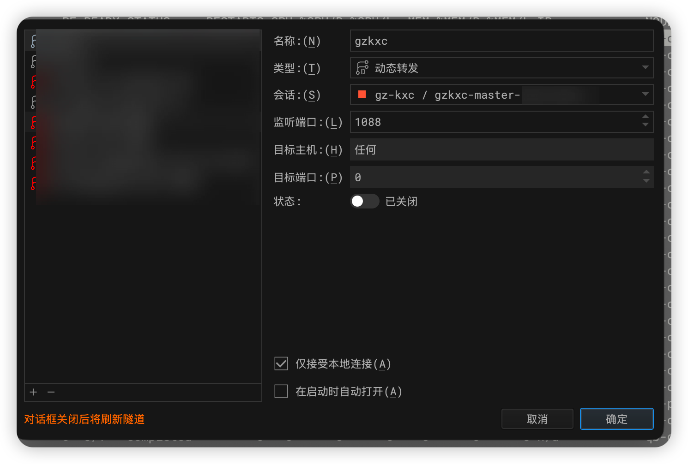
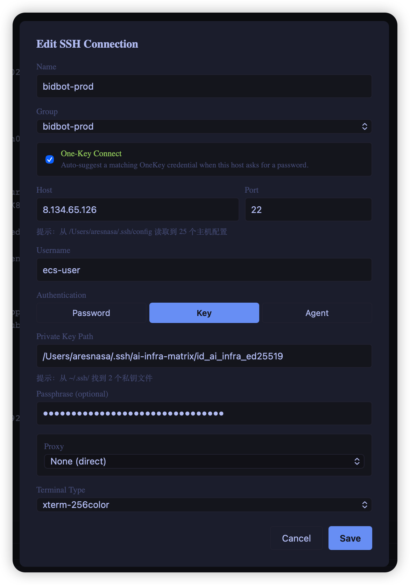
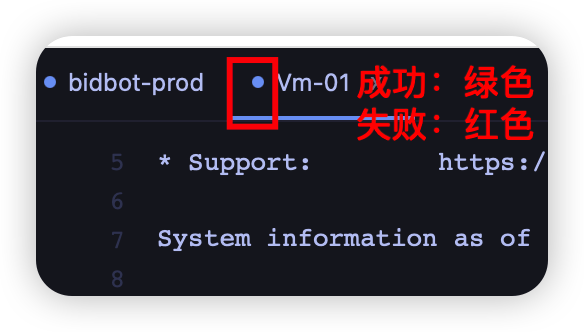
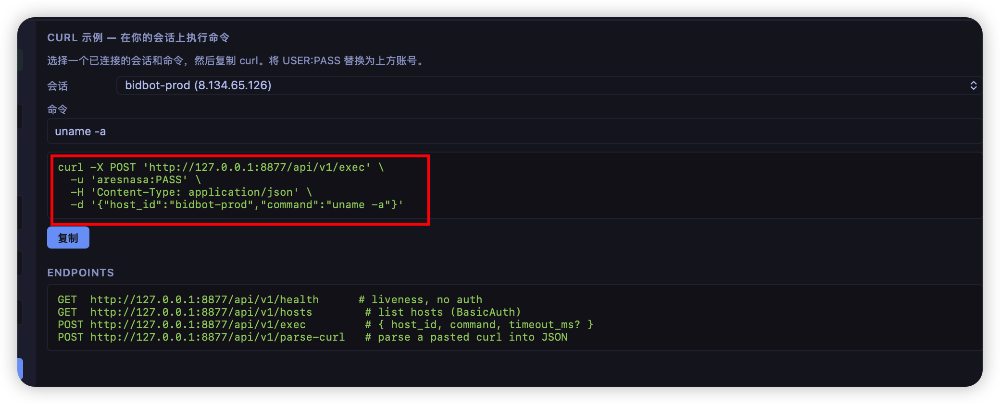
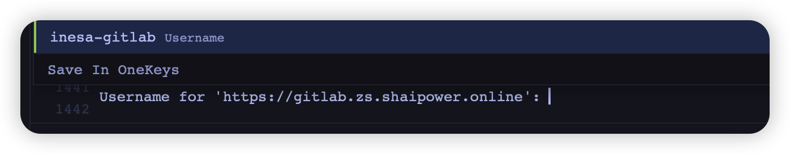

1. 继续完善本项目，需要能够正确的弹出 onekey
2. 检查弹窗逻辑，需要在最新的命令行这一行之下，而不是遮挡最新的命令行，需要修复，需要优化小窗口，支持记录用户默认行为（例如用户每次打开本 app 都会最大化，则需要记录用户的习惯，不需要让用户每次都重新配置），让本软件能够自适应的协助用户
3. 继续优化弹窗逻辑，用户输入错误的命令不需要在弹窗提示，需要记录成功的命令即可，自动补全还是提示了错误的命令，不符合预期，需要修复，继续优化终端逻辑，运行的命令弹出提示了，但是没法按期望的运行，卡主了
4. 错误的历史记录不应该被保留到弹窗，修复这个问题，只需要保留正确的执行记录。
5. 弹窗还是会保留错误的 pwdwd，可以用这个命令自动测试，加密密码是 123，链接终端选ai-infra-dev-vm01-216，完整的测试并通过后再结束。
6. 本项目还要支持记录必要的日志功能，以便在出现问题时能够快速定位和解决，不能收集敏感的用户信息，包括但不限于（密码，密钥，加密密钥，密钥，用户信息，账号信息等），所有的敏感数据必须保存在用户本地并且需要完全加密，日志只保留本项目的运行情况
7. 本项目还要支持用户通过 ssh 命令登录机器后自动配置终端到左侧，保证配置能够正确的处理，中间的调试过程可以不用记录，但是最终配置成功需要记录，避免重复配置。
8. 设计一个本项目的桌面 app 图标的 svg，结合 rust 的快速和本地安全
9. 基于https://github.com/op7418/logo-generator-skill这个 skill 来设计图标，可以加这个 skill 集成到本项目中，并优化图标设计结合着生成一个好看的应用图标
10. 继续检查历史命令，还是有很多错误的命令被提示出来不符合预期，这里可以支持用户删除建议的这些命令，应该是有脏数据影响了，这里可以集成 duckdb 到本项目，高效的处理和分类历史命令和用户行为。
11. 增加同步配置到加密 git 的函数，支持同步加密配置到 gist，icloud，等其他云在线加密库，远程只存加密后的数据，本地存解密的密钥，保证数据的对等安全
12. 扫描本地代码，需要保证安全，检查所有 rust 和 c++相关 CVE，保证安全
13. 增加会话支持调用本地 zsh 和终端
14. 检查会话的展示，要支持调整展示框的大小，支持 4 分隔 8 分隔等模式，并排显示多个终端，支持跨终端会话的比对模式，然后分辨率要支持全屏，继续改造本应用并测试，直到所有测试都通过才能结束
15. 检查会话分配功能是否按照预期分配到正确的终端会话中
16. 支持用户拖动会话，按照用户自定义的方式显示不同的 ssh/终端会话
17. 本终端还要支持退出后恢复用户上一次登录状态的功能，记录相关会话状态和登录后的行为，以便在下次登录时能够恢复到上一次的状态，所有的数据都记录在本地并加密
18. 询问客户，同时也要避免打扰到客户，客户选择恢复则直切换到上一次的目录，而不是执行上一次的命令或者脚本，避免造成干扰，这里可以方便用户切换路径和记错路径，其他的高危操作需要避免，比如 dd 有数据的盘，rm -rf /* 或者 rm -rf /这类高危操作都需要提示客户
19. 无法直接使用鼠标点击会话拖拽调整会话分屏，检查并修复，分屏后无法输入命令了需要检查并修复，然后完整测试直到测试通过，需要模拟用户使用鼠标挪动会话分屏
20. 检查会话逻辑，需要支持按回车重连或者鼠标右键会话重连
21. 检查 多分屏逻辑，除了 第一个分屏外的其他终端会话都无法输入命令，需要修复，然后测试需要模拟鼠标拉拽会话能创建分屏，继续测试并修复，直到问题被完全修复。
22. 检查顶部的不同会话，这里能够根据不同的会话页进行拖拽分屏，改造相关逻辑
23. [@Image](zed:///agent/pasted-image?name=Image) 选中会话时会错误的多选中这些内容，不符合预期，，同时要支持鼠标拖拽会话能够自由的生成多个子窗口，同时还要修复窗口无法被填满的问题
24. [@Image](zed:///agent/pasted-image?name=Image) 这些会话框需要能支持通过复制左边的会话填充，支持自定义会话框，同时增加会话框的顶部分隔栏，支持高亮会话框
25. 使用浅色的框包裹这个会话的[@Image](zed:///agent/pasted-image?name=Image) 整体，然后支持用户自定义外观。调整相关代码。
26. [@Image](zed:///agent/pasted-image?name=Image) 拉拽新的会话到多窗口时会出现错误的回显数据，需要修复。
27. 改造快捷点，使用 command+w 退出的是单个会话而不是整个程序
28. [@Image](zed:///agent/pasted-image?name=Image) 每一个小的窗口对应单独的 rust 线程，这里可以按照窗口来分组，保证分组中的会话是独立的，不需要重复在会话顶部开启新的会话
29. 方案 b，展示为空时需要复制当前焦点的会话，如果用户打开了已有会话复制的话则是通过用户焦点的终端进行复制，如果是从左侧会话栏拖拽则是需要新开会话来对比。
30. control+w 不能关闭窗口，快捷健需要调整，标准的 linux 终端快捷键在会话中需要能正常执行的
31. 无法通过拖动左边的会话到2 分屏窗口，不符合期望，需要修复
32. 改造分屏这个逻辑，支持分屏提示，一个新的会话支持多分屏，可以多个会话放到多个分屏中，继续优化相关逻辑
33. 这里的窗口逻辑不要用 2/4/8 这种，而是按需开启窗口，继续优化，客户如果只在 1 个窗口中拖拽会话则按需的新增一个会话，不需要一次性增加 2/4/8 这种的，修复相关逻辑
34. 这里继续改造拖拽时需要提示用户是横着摆放会话还是竖着摆放会话，需要都支持，这里可以用中线作为标记，继续优化拖拽逻辑，这里没法正确的按照 4 方块进行拖拽，会错误的产生多个不需要的四方块
35. 关闭最后一个窗口的时候提示用户是否确实要关闭本软件，同时增加一个默认勾选按钮和取消默认关闭，这里都要显示给用户选择，然后继续优化分屏，这里可以先显示横线和竖线，让客户放到期望的框中。
36. 空白窗格右上角的按钮点击无反应，检查并修复，然后split 和distribute 模式都要支持开启和关闭（关闭则使用标签页平铺所有窗格），拖拽的时候会话在 4 个窗格的某一个窗格需要高亮这个窗格提示用户，窗格右上角的十字按钮要支持关闭窗格，支持焦点选中窗格，然后 command+w 关闭窗格
37. 配置会话时支持读取本地配置，这里可以提示相关路径而不是让用户必须输入，改造相关函数，本地配置需要存到一个默认位置，比如加目录的~/.config/rusterm/下，在 cargo clean 时不要删除已有的.config目录
38. 4 个窗格需要按照左侧上下窗口单独拖拽，右上角横放，左下角横放，这里需要调整相关逻辑，4 窗格方式分布逻辑继续调整，点击了 compare 后所有窗口都要高亮了，不用焦点了，非 compare 模式可以单窗口焦点
39. 检查终端方向键的按钮逻辑，没法使用方向键移动光标，同时还要支持鼠标选中复制等常用的终端功能，这里可以参考 https://github.com/kingToolbox/WindTerm，检查方向键和鼠标选中终端复制键，没有实现相关功能，继续调整代码
40. 无法使用鼠标选中复制，继续调整代码
41. 支持鼠标选择复制了，但是还需要支持双击关键字并复制，需要继续修复代码
42. 同时需要调整下切换app 时使用的 app 图标，太大了，需要使用 mac 默认的图标大小，改造一下
43. 每次登录新的会话后都会在终端显示的输出ecs-user@bidbot-prod:~$ __rusterm_precmd() { printf '\e]133;D;%s\e\\' "$?"; printf '\e]133;A\e\\'; printf '\e]7;file://%s%s\e\\' "${HOSTNAME:-localhost}" "$PWD"; }; if [ -n "$ZSH_VERSION" ]; then precmd _functions+=(__rusterm_precmd); elif [ -n "$BASH_VERSION" ]; then PROMPT_COMMAND="__rusterm_precmd${PROMPT_COMMAND:+;$PROMPT_COMMAND}"; fi    这个不符合预期，需要隐藏，避免干扰用户，同时继续修复 onekey 问题[@Image](zed:///agent/pasted-image?name=Image) ，同时所有终端中的弹窗会话都要支持俘获（复制异常），强化相关代码
44. 检查会话顶部弹窗的显示逻辑这里不能遮挡相关命令，可以在非主焦点显示弹窗，弹窗触发逻辑也需要优化，避免遮挡视线，优化相关代码
45. 前端页面的布局支持用户自定义，然后自动保存相关布局，而不是调整配置文件，这里需要在后端定期记录并同步到配置中，每个会话需要一个独立的配置 json 段保证用户的自定义框能够被正确的保存
46. 弹窗可以显示最近的 3 行在会话命令行的下方，不要太多，否则容易遮挡视线
47. 继续强化 compare-mode，如果开启了，需要将两个窗口或者多个窗口输出的结果进行比对并高亮差异，这里需要预处理差异，如果太多差异则需要提醒弹窗告诉用户有大量差异是否需要继续，继续完善相关代码
48. 检查弹窗的弹出逻辑这里需要实时的同步用户输入成功的命令，及时的打印出建议（支持用户选择 3/5/10），同时支持关闭提示建议，继续改造相关代码，同时能够减少建议，这里都需要能够快速基于用户习惯来保存会话习惯
49. 改造前端窗口，需要支持调整，会话大小需要能够调整大小，然后保存会话的分辨率，继续调整相关 rust 代码和前端代码
50. 强化本项目的会话展示，需要颜色多一些，支持各种 xterm 的颜色展示
51. 添加自定义按键绑定的模块，支持自定义绑定快捷键
52. 还要增加皮肤配置，支持自定义皮肤
53. compare-mode下使用鼠标滚轮，需要所有会话同步滚动。
54. 是的，所有截图中的功能都需要实现
55. 改进本项目，增加一个影子沙盒系统（能够获取登录机器的执行结果，但是不能直接执行命令），需要用户确认才能将会话中的结果和 LLM 模型交互，这里弹窗只是模型的建议，最终执行确认需要用户确认，可以将模型的建议通过弹窗提示用户，改造实现这个功能
56. 测试本项目直到所有功能都符合预期才能结束
57. 改造拖拽的逻辑，左键一次开始调整，再次左键停止调整窗口
58. 增加本项目支持使用代理（http/socks5/https）访问 ssh 会话
59. diff的告警需要增加一个不再提示的按钮，能够开启和关闭
60. 优化一下窗口调整逻辑，这里点击了左键后再次点击没法释放窗口拖拽，需要更加灵活，改造相关代码
61. [@Image](zed:///agent/pasted-image?name=Image) 修复这个错误记录无法删除的问题，同时优化弹窗隐藏逻辑如果焦点变换了可以隐藏，但是密码不行，需要一直到用户取消才能隐藏密码弹窗，然后检查键盘输入方向键无法正确的移动会话的光标，需要修复
62. [@Image](zed:///agent/pasted-image?name=Image) 弹窗和底部的子框是自适应的弹出，同时用户输入错命令支持修正为正确的（常见命令，比如 docker 输错为 dockre 等之类的情况，这里可以在 rusterm 后台的 duckdb 进行统计，帮助完善本地的错命令库纠正为正确的命令）
63. 扩展本应用，支持监听 restful api（输入basicAuth 然后根据提交的 curl 命令+json 执行指令，作为中转站，这里需要保证命令的合法和非破坏性，强化这块功能），同时还要支持 ssh 隧道代理（这块功能需要保证隧道的稳定和定期重连）
64. 终端还要支持配置快速登录的初始化脚本（支持expect 语法，自动识别用户登录习惯，然后自动填入 sudo 密码之类的常用功能），可以在 app 后台收集用户习惯，然后强化 duckdb 的向量，将成功率高和失败率高的分别做排序，让用户能够避免出错，提高成功率，然后避免收集敏感的密钥或者密码等认证信息，这里需要确保用户的认证信息安全<[fim-middle]>，然后增加一个显示收集用户使用习惯的选项，显示的说明会收集哪些习惯，一定不会收集的内容（增加说明避免造成误会），然后如果用户确认后，可以将非敏感的 duckdb 的习惯数据（非密码非密钥）上报到 github 的某个gist（或者对象存储），未来需要智能的优化本项目。
65. 打开的会话需要保存状态（如果命令行退出或者执行完成，成功/错误都需要有提示，绿色成功，红色失败）
66. 继续强化send 和 shell，支持基于历史记录的补全，根据 duckdb 中用户常用的命令进行补全。
67. 启动会话后的 restful api 接口也需要在底部能够配置，然后自动化的调用 rusterm 执行相关命令（通过 curl+basicauth 才能执行）
68. 改造restful api 的权限，如果用户已经执行了 sudo 权限，需要能够自动传递给 api 不用每次都让用户重复执行，导致❯ curl -X POST 'http://127.0.0.1:8877/api/v1/exec' \
  -u 'aresnasa:密码' \
  -H 'Content-Type: application/json' \
  -d '{"host_id":"bidbot-prod","command":"docker ps"}'
{"exit_code":null,"stdout":"","stderr":"permission denied while trying to connect to the docker API at unix:///var/run/docker.sock\n","timed_out":false,"duration_ms":865}权限不足，改造一下，然后改造一下复制命令，这里可以先根据用户配置的账号和密码做 export 申明，然后再输出 curl 命令，做运行时的命令，这样更加方便，改造下
69. 继续改造API 模式，支持流式处理，添加相关支持，能让模型通过流式聊天交互式的修复问题，接入当前主流的模型，可以集成一个模型网关到 API 中支持切换不同的模型来协助排查问题。
70. 继续优化录入 ssh 的逻辑支持解析xuchao@jump.zs.shaipower.online -p 22类似这种格式的解析并录入配置，配置自动填充，默认没有配置端口则根据 ssh 或者 telnet 来自动配置，还要添加串口的支持，强化相关代码
71. 优化 API，强化相关功能
72. 使用 git 同步代码需要让输入 token 时，这里配置好了，需要支持切换不同的用户和密码（或者 token），这里需要能够支持切换并且记录上一次成功的匹配租户，自动填入，避免用户再次输入，改进一下弹窗的逻辑
73. API 还要支持传递脚本（这里需要一个 guard 函数能够先扫描脚本，如果安全才能继续执行，还需要保证脚本被编码为了base64 后的特殊情况，这里需要基于一些已有的系统工具来强化这块扫描能力），工具必须保证安全（可以先在沙箱中预执行，保证安全后才能真的发送，这里需要强化相关保护功能）
74. 可以将https://github.com/Dicklesworthstone/destructive_command_guard这个项目集成到本项目强化相关危险命令的执行和危险脚本/python 的执行
75. 优化性能，如果 linux 使用 tree 或者 ls 几百万个文件这里需要对会话进行保护避免过多的输出，这里需要分片输出
76. 检查会话恢复逻辑，多次都没有触发会话恢复了，需要修复
77. 继续优化会话性能，目前第一次连接成功后未能正确的快速处理，这里需要优化，刚连接上因为需要加载很多的记忆，这里可以采用 async的方式来并行进行，主干是快速获取会话的 IO，枝干是加载用户常用的历史记忆，记忆可以稍后并行加载，这里继续优化。
78. 同时需要集成https://github.com/ohmyzsh/ohmyzsh到本项目原生支持 ohmyzsh，很多自动弹出的功能可以集成到本项目
79.
