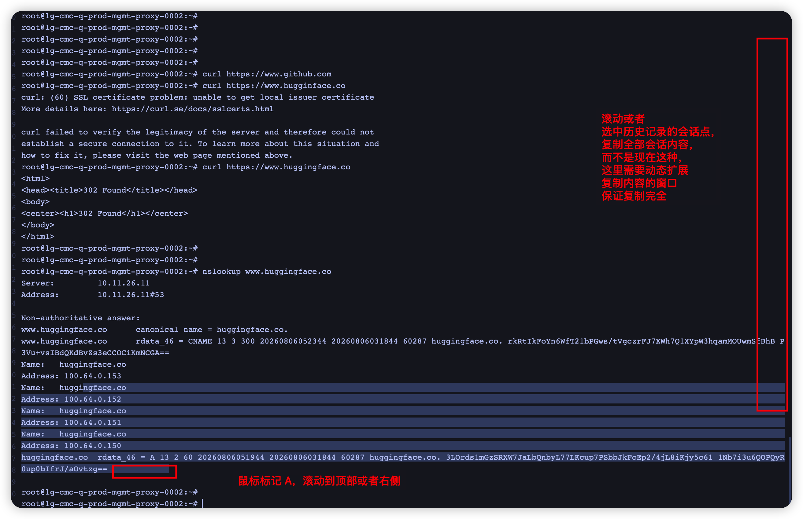
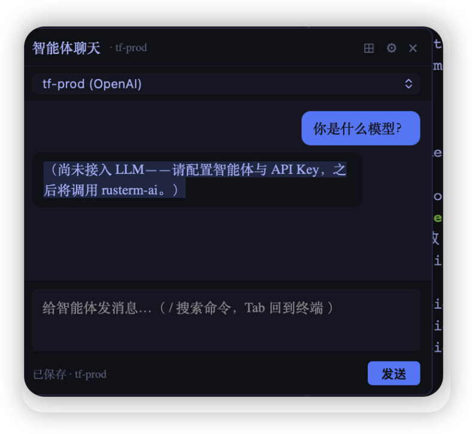
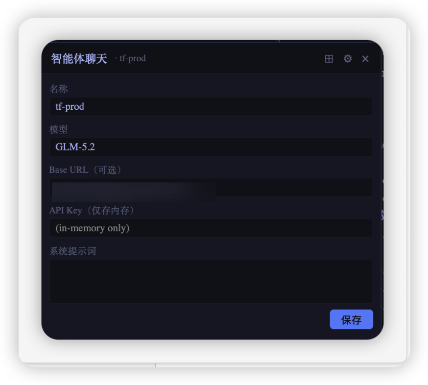
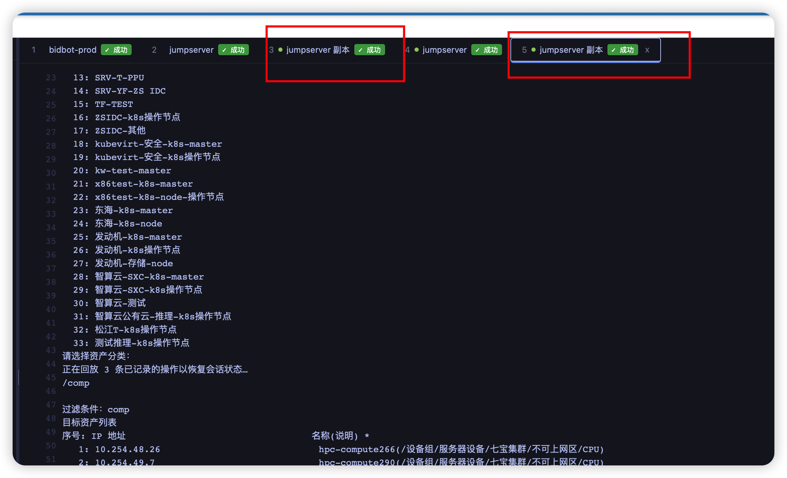
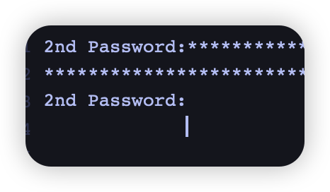
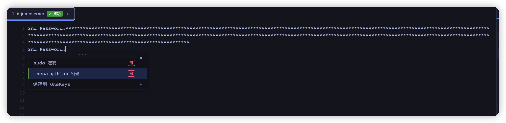
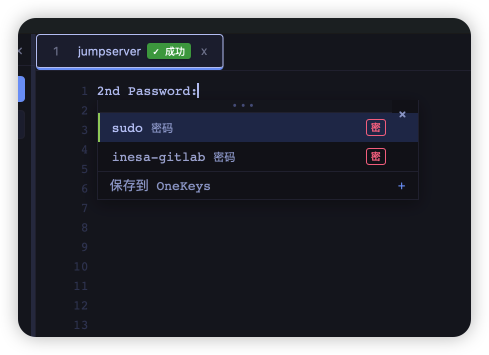
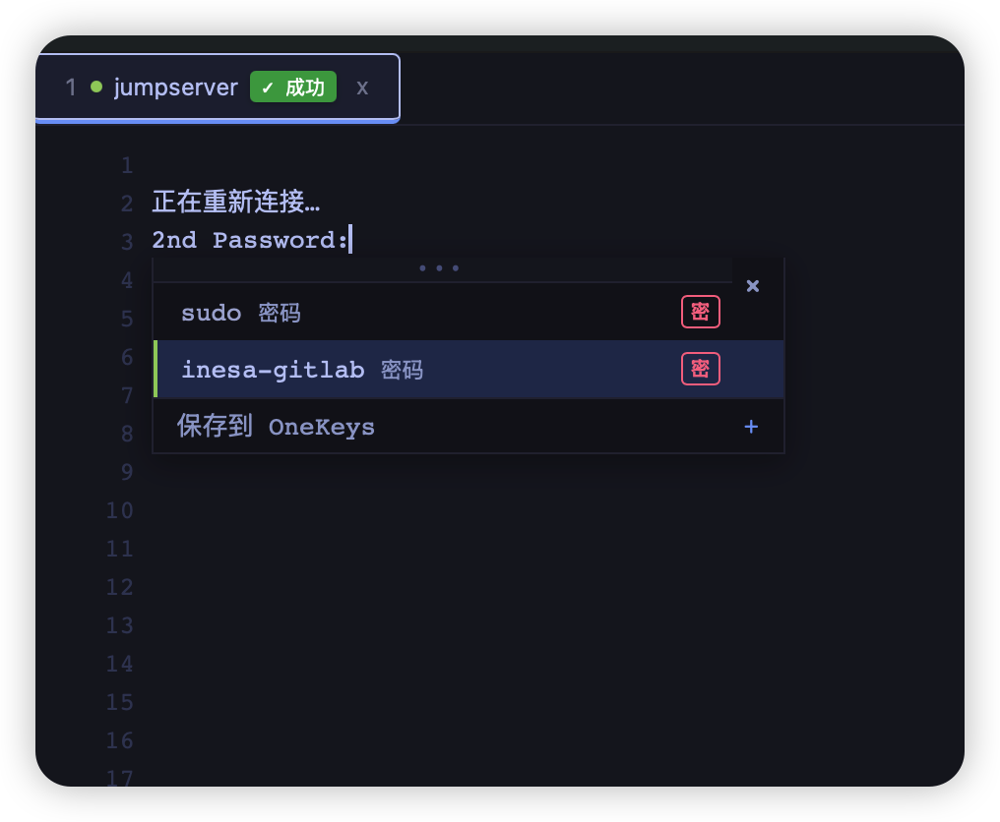

1. 继续完善本项目，需要能够正确的弹出 onekey
2. 检查弹窗逻辑，需要在最新的命令行这一行之下，而不是遮挡最新的命令行，需要修复，需要优化小窗口，支持记录用户默认行为（例如用户每次打开本 app 都会最大化，则需要记录用户的习惯，不需要让用户每次都重新配置），让本软件能够自适应的协助用户
3. 继续优化弹窗逻辑，用户输入错误的命令不需要在弹窗提示，需要记录成功的命令即可，自动补全还是提示了错误的命令，不符合预期，需要修复，继续优化终端逻辑，运行的命令弹出提示了，但是没法按期望的运行，卡主了
4. 错误的历史记录不应该被保留到弹窗，修复这个问题，只需要保留正确的执行记录。
5. 弹窗还是会保留错误的 pwdwd，可以用这个命令自动测试，加密密码是 123，链接终端选ai-infra-dev-vm01-216，完整的测试并通过后再结束。
6. 本项目还要支持记录必要的日志功能，以便在出现问题时能够快速定位和解决，不能收集敏感的用户信息，包括但不限于（密码，密钥，加密密钥，密钥，用户信息，账号信息等），所有的敏感数据必须保存在用户本地并且需要完全加密，日志只保留本项目的运行情况
7. 本项目还要支持用户通过 ssh 命令登录机器后自动配置终端到左侧，保证配置能够正确的处理，中间的调试过程可以不用记录，但是最终配置成功需要记录，避免重复配置。
8. 设计一个本项目的桌面 app 图标的 svg，结合 rust 的快速和本地安全
9. 基于https://github.com/op7418/logo-generator-skill这个 skill 来设计图标，可以加这个 skill 集成到本项目中，并优化图标设计结合着生成一个好看的应用图标
10. 继续检查历史命令，还是有很多错误的命令被提示出来不符合预期，这里可以支持用户删除建议的这些命令，应该是有脏数据影响了，这里可以集成 duckdb 到本项目，高效的处理和分类历史命令和用户行为。
11. 增加同步配置到加密 git 的函数，支持同步加密配置到 gist，icloud，等其他云在线加密库，远程只存加密后的数据，本地存解密的密钥，保证数据的对等安全
12. 扫描本地代码，需要保证安全，检查所有 rust 和 c++相关 CVE，保证安全
13. 增加会话支持调用本地 zsh 和终端
14. 检查会话的展示，要支持调整展示框的大小，支持 4 分隔 8 分隔等模式，并排显示多个终端，支持跨终端会话的比对模式，然后分辨率要支持全屏，继续改造本应用并测试，直到所有测试都通过才能结束
15. 检查会话分配功能是否按照预期分配到正确的终端会话中
16. 支持用户拖动会话，按照用户自定义的方式显示不同的 ssh/终端会话
17. 本终端还要支持退出后恢复用户上一次登录状态的功能，记录相关会话状态和登录后的行为，以便在下次登录时能够恢复到上一次的状态，所有的数据都记录在本地并加密
18. 询问客户，同时也要避免打扰到客户，客户选择恢复则直切换到上一次的目录，而不是执行上一次的命令或者脚本，避免造成干扰，这里可以方便用户切换路径和记错路径，其他的高危操作需要避免，比如 dd 有数据的盘，rm -rf /* 或者 rm -rf /这类高危操作都需要提示客户
19. 无法直接使用鼠标点击会话拖拽调整会话分屏，检查并修复，分屏后无法输入命令了需要检查并修复，然后完整测试直到测试通过，需要模拟用户使用鼠标挪动会话分屏
20. 检查会话逻辑，需要支持按回车重连或者鼠标右键会话重连
21. 检查 多分屏逻辑，除了 第一个分屏外的其他终端会话都无法输入命令，需要修复，然后测试需要模拟鼠标拉拽会话能创建分屏，继续测试并修复，直到问题被完全修复。
22. 检查顶部的不同会话，这里能够根据不同的会话页进行拖拽分屏，改造相关逻辑
23. [@Image](zed:///agent/pasted-image?name=Image) 选中会话时会错误的多选中这些内容，不符合预期，，同时要支持鼠标拖拽会话能够自由的生成多个子窗口，同时还要修复窗口无法被填满的问题
24. [@Image](zed:///agent/pasted-image?name=Image) 这些会话框需要能支持通过复制左边的会话填充，支持自定义会话框，同时增加会话框的顶部分隔栏，支持高亮会话框
25. 使用浅色的框包裹这个会话的[@Image](zed:///agent/pasted-image?name=Image) 整体，然后支持用户自定义外观。调整相关代码。
26. [@Image](zed:///agent/pasted-image?name=Image) 拉拽新的会话到多窗口时会出现错误的回显数据，需要修复。
27. 改造快捷点，使用 command+w 退出的是单个会话而不是整个程序
28. [@Image](zed:///agent/pasted-image?name=Image) 每一个小的窗口对应单独的 rust 线程，这里可以按照窗口来分组，保证分组中的会话是独立的，不需要重复在会话顶部开启新的会话
29. 方案 b，展示为空时需要复制当前焦点的会话，如果用户打开了已有会话复制的话则是通过用户焦点的终端进行复制，如果是从左侧会话栏拖拽则是需要新开会话来对比。
30. control+w 不能关闭窗口，快捷健需要调整，标准的 linux 终端快捷键在会话中需要能正常执行的
31. 无法通过拖动左边的会话到2 分屏窗口，不符合期望，需要修复
32. 改造分屏这个逻辑，支持分屏提示，一个新的会话支持多分屏，可以多个会话放到多个分屏中，继续优化相关逻辑
33. 这里的窗口逻辑不要用 2/4/8 这种，而是按需开启窗口，继续优化，客户如果只在 1 个窗口中拖拽会话则按需的新增一个会话，不需要一次性增加 2/4/8 这种的，修复相关逻辑
34. 这里继续改造拖拽时需要提示用户是横着摆放会话还是竖着摆放会话，需要都支持，这里可以用中线作为标记，继续优化拖拽逻辑，这里没法正确的按照 4 方块进行拖拽，会错误的产生多个不需要的四方块
35. 关闭最后一个窗口的时候提示用户是否确实要关闭本软件，同时增加一个默认勾选按钮和取消默认关闭，这里都要显示给用户选择，然后继续优化分屏，这里可以先显示横线和竖线，让客户放到期望的框中。
36. 空白窗格右上角的按钮点击无反应，检查并修复，然后split 和distribute 模式都要支持开启和关闭（关闭则使用标签页平铺所有窗格），拖拽的时候会话在 4 个窗格的某一个窗格需要高亮这个窗格提示用户，窗格右上角的十字按钮要支持关闭窗格，支持焦点选中窗格，然后 command+w 关闭窗格
37. 配置会话时支持读取本地配置，这里可以提示相关路径而不是让用户必须输入，改造相关函数，本地配置需要存到一个默认位置，比如加目录的~/.config/rusterm/下，在 cargo clean 时不要删除已有的.config目录
38. 4 个窗格需要按照左侧上下窗口单独拖拽，右上角横放，左下角横放，这里需要调整相关逻辑，4 窗格方式分布逻辑继续调整，点击了 compare 后所有窗口都要高亮了，不用焦点了，非 compare 模式可以单窗口焦点
39. 检查终端方向键的按钮逻辑，没法使用方向键移动光标，同时还要支持鼠标选中复制等常用的终端功能，这里可以参考 https://github.com/kingToolbox/WindTerm，检查方向键和鼠标选中终端复制键，没有实现相关功能，继续调整代码
40. 无法使用鼠标选中复制，继续调整代码
41. 支持鼠标选择复制了，但是还需要支持双击关键字并复制，需要继续修复代码
42. 同时需要调整下切换app 时使用的 app 图标，太大了，需要使用 mac 默认的图标大小，改造一下
43. 每次登录新的会话后都会在终端显示的输出ecs-user@bidbot-prod:~$ __rusterm_precmd() { printf '\e]133;D;%s\e\\' "$?"; printf '\e]133;A\e\\'; printf '\e]7;file://%s%s\e\\' "${HOSTNAME:-localhost}" "$PWD"; }; if [ -n "$ZSH_VERSION" ]; then precmd _functions+=(__rusterm_precmd); elif [ -n "$BASH_VERSION" ]; then PROMPT_COMMAND="__rusterm_precmd${PROMPT_COMMAND:+;$PROMPT_COMMAND}"; fi    这个不符合预期，需要隐藏，避免干扰用户，同时继续修复 onekey 问题[@Image](zed:///agent/pasted-image?name=Image) ，同时所有终端中的弹窗会话都要支持俘获（复制异常），强化相关代码
44. 检查会话顶部弹窗的显示逻辑这里不能遮挡相关命令，可以在非主焦点显示弹窗，弹窗触发逻辑也需要优化，避免遮挡视线，优化相关代码
45. 前端页面的布局支持用户自定义，然后自动保存相关布局，而不是调整配置文件，这里需要在后端定期记录并同步到配置中，每个会话需要一个独立的配置 json 段保证用户的自定义框能够被正确的保存
46. 弹窗可以显示最近的 3 行在会话命令行的下方，不要太多，否则容易遮挡视线
47. 继续强化 compare-mode，如果开启了，需要将两个窗口或者多个窗口输出的结果进行比对并高亮差异，这里需要预处理差异，如果太多差异则需要提醒弹窗告诉用户有大量差异是否需要继续，继续完善相关代码
48. 检查弹窗的弹出逻辑这里需要实时的同步用户输入成功的命令，及时的打印出建议（支持用户选择 3/5/10），同时支持关闭提示建议，继续改造相关代码，同时能够减少建议，这里都需要能够快速基于用户习惯来保存会话习惯
49. 改造前端窗口，需要支持调整，会话大小需要能够调整大小，然后保存会话的分辨率，继续调整相关 rust 代码和前端代码
50. 强化本项目的会话展示，需要颜色多一些，支持各种 xterm 的颜色展示
51. 添加自定义按键绑定的模块，支持自定义绑定快捷键
52. 还要增加皮肤配置，支持自定义皮肤
53. compare-mode下使用鼠标滚轮，需要所有会话同步滚动。
54. 是的，所有截图中的功能都需要实现
55. 改进本项目，增加一个影子沙盒系统（能够获取登录机器的执行结果，但是不能直接执行命令），需要用户确认才能将会话中的结果和 LLM 模型交互，这里弹窗只是模型的建议，最终执行确认需要用户确认，可以将模型的建议通过弹窗提示用户，改造实现这个功能
56. 测试本项目直到所有功能都符合预期才能结束
57. 改造拖拽的逻辑，左键一次开始调整，再次左键停止调整窗口
58. 增加本项目支持使用代理（http/socks5/https）访问 ssh 会话
59. diff的告警需要增加一个不再提示的按钮，能够开启和关闭
60. 优化一下窗口调整逻辑，这里点击了左键后再次点击没法释放窗口拖拽，需要更加灵活，改造相关代码
61. [@Image](zed:///agent/pasted-image?name=Image) 修复这个错误记录无法删除的问题，同时优化弹窗隐藏逻辑如果焦点变换了可以隐藏，但是密码不行，需要一直到用户取消才能隐藏密码弹窗，然后检查键盘输入方向键无法正确的移动会话的光标，需要修复
62. [@Image](zed:///agent/pasted-image?name=Image) 弹窗和底部的子框是自适应的弹出，同时用户输入错命令支持修正为正确的（常见命令，比如 docker 输错为 dockre 等之类的情况，这里可以在 rusterm 后台的 duckdb 进行统计，帮助完善本地的错命令库纠正为正确的命令）
63. 扩展本应用，支持监听 restful api（输入basicAuth 然后根据提交的 curl 命令+json 执行指令，作为中转站，这里需要保证命令的合法和非破坏性，强化这块功能），同时还要支持 ssh 隧道代理（这块功能需要保证隧道的稳定和定期重连）
64. 终端还要支持配置快速登录的初始化脚本（支持expect 语法，自动识别用户登录习惯，然后自动填入 sudo 密码之类的常用功能），可以在 app 后台收集用户习惯，然后强化 duckdb 的向量，将成功率高和失败率高的分别做排序，让用户能够避免出错，提高成功率，然后避免收集敏感的密钥或者密码等认证信息，这里需要确保用户的认证信息安全<[fim-middle]>，然后增加一个显示收集用户使用习惯的选项，显示的说明会收集哪些习惯，一定不会收集的内容（增加说明避免造成误会），然后如果用户确认后，可以将非敏感的 duckdb 的习惯数据（非密码非密钥）上报到 github 的某个gist（或者对象存储），未来需要智能的优化本项目。
65. 打开的会话需要保存状态（如果命令行退出或者执行完成，成功/错误都需要有提示，绿色成功，红色失败）
66. 继续强化send 和 shell，支持基于历史记录的补全，根据 duckdb 中用户常用的命令进行补全。
67. 启动会话后的 restful api 接口也需要在底部能够配置，然后自动化的调用 rusterm 执行相关命令（通过 curl+basicauth 才能执行）
68. 改造restful api 的权限，如果用户已经执行了 sudo 权限，需要能够自动传递给 api 不用每次都让用户重复执行，导致❯ curl -X POST 'http://127.0.0.1:8877/api/v1/exec' \
  -u 'aresnasa:密码' \
  -H 'Content-Type: application/json' \
  -d '{"host_id":"bidbot-prod","command":"docker ps"}'
{"exit_code":null,"stdout":"","stderr":"permission denied while trying to connect to the docker API at unix:///var/run/docker.sock\n","timed_out":false,"duration_ms":865}权限不足，改造一下，然后改造一下复制命令，这里可以先根据用户配置的账号和密码做 export 申明，然后再输出 curl 命令，做运行时的命令，这样更加方便，改造下
69. 继续改造API 模式，支持流式处理，添加相关支持，能让模型通过流式聊天交互式的修复问题，接入当前主流的模型，可以集成一个模型网关到 API 中支持切换不同的模型来协助排查问题。
70. 继续优化录入 ssh 的逻辑支持解析xuchao@jump.zs.shaipower.online -p 22类似这种格式的解析并录入配置，配置自动填充，默认没有配置端口则根据 ssh 或者 telnet 来自动配置，还要添加串口的支持，强化相关代码
71. 优化 API，强化相关功能
72. 使用 git 同步代码需要让输入 token 时，这里配置好了，需要支持切换不同的用户和密码（或者 token），这里需要能够支持切换并且记录上一次成功的匹配租户，自动填入，避免用户再次输入，改进一下弹窗的逻辑
73. API 还要支持传递脚本（这里需要一个 guard 函数能够先扫描脚本，如果安全才能继续执行，还需要保证脚本被编码为了base64 后的特殊情况，这里需要基于一些已有的系统工具来强化这块扫描能力），工具必须保证安全（可以先在沙箱中预执行，保证安全后才能真的发送，这里需要强化相关保护功能）
74. 可以将https://github.com/Dicklesworthstone/destructive_command_guard这个项目集成到本项目强化相关危险命令的执行和危险脚本/python 的执行
75. 优化性能，如果 linux 使用 tree 或者 ls 几百万个文件这里需要对会话进行保护避免过多的输出，这里需要分片输出
76. 检查会话恢复逻辑，多次都没有触发会话恢复了，需要修复
77. 继续优化会话性能，目前第一次连接成功后未能正确的快速处理，这里需要优化，刚连接上因为需要加载很多的记忆，这里可以采用 async的方式来并行进行，主干是快速获取会话的 IO，枝干是加载用户常用的历史记忆，记忆可以稍后并行加载，这里继续优化。
78. 同时需要集成https://github.com/ohmyzsh/ohmyzsh到本项目原生支持 ohmyzsh，很多自动弹出的功能可以集成到本项目
79. 窗口拉动需要显性的显示，否则不好点击拖拽，优化一下前端，同时需要优化本项目交互式的 ptty 的性能，这里需要保证体感好，然后需要适配大部分的交互逻辑，保证本项目能应对所有已有的场景
80. ==> 100eac5a-2ef7-427f-84e1-9e03e2b61820
{
  "exit_code": null,
  "stdout": "\u001b]0;xuchao@10.10.192.55\u0007\u001b]0;xuchao@10.10.192.55\u0007********************************************************************************\r\n*                             齐治交互终端 v3.3.13                             *\r\n*             版权所有(c)浙江齐治科技股份有限公司。保留一切权利。              *\r\n********************************************************************************\r\n\r\n\r\n资产分类列表\r\n序号: 资产分类\r\n   0: 全部资产\r\n   1: OSS-SXC-k8s-master\r\n   2: OSS-SXC-k8s-node\r\n   3: OSS-SXC-k8s操作节点\r\n   4: OSS-test-k8s-node\r\n   5: SRV-AI4S\r\n   6: SRV-FDJ\r\n   7: SRV-GZY-CPU/HPC\r\n   8: SRV-GZY-GPU\r\n   9: SRV-GZY-流动组\r\n  10: SRV-PJH\r\n  11: SRV-SXC\r\n  12: SRV-T\r\n  13: SRV-T-PPU\r\n  14: SRV-YF-ZS IDC\r\n  15: TF-TEST\r\n  16: ZSIDC-k8s操作节点\r\n  17: ZSIDC-其他\r\n  18: kubevirt-安全-k8s-master\r\n  19: kubevirt-安全-k8s操作节点\r\n-- 共 34 条记录。Ctrl-F：下一页 --",
  "stderr": "",
  "timed_out": false,
  "truncated": false,
  "duration_ms": 3381
},检查这里的交互逻辑，需要记录用户如何通过命令行交互式的登录到对应节点的，这里不是简单的用 tty 就完了，需要完整的模拟登录过程并记录各种常用的组合，然后模拟输入，这样才能真正的模拟访问堡垒机的情况，继续改造
81. 访问jumpserver 的会话会经常卡主，需要优化（增加一些鲁棒性）避免随时卡住后导致无法正确的输入命令了。
82. 检查会话恢复的逻辑，没有触发会话恢复，需要记录上一次用户终端的登录情况，然后启动时恢复
83. 这里可以复用已有的会话链接，模拟交互式的提交即可，改造 API 的逻辑
84. [@Image](zed:///agent/pasted-image?name=Image) 继续优化会话，会出现这种输入了命令无响应的情况，增加鲁棒性，调整相关会话代码，对于 jumpserver 这种必须使用 tty 交互的会话需要增加额外的鲁棒性代码来保证稳定性。
85. 继续完善 API，可以创建一个影子子窗口（复用 ssh 登录的会话），减少 curl 命令的复杂度,这里可以创建一个 alias 到本地终端，减少类似的交互，比如创建一个单独的函数能让终端和其他智能体直接通过 curl 的方式来和真正的堡垒机终端交互，这样更加优雅
86. 改造自动输出export RUSTERM_API_URL='http://127.0.0.1:8877'
export RUSTERM_API_USER='aresnasa'
if [ -z "${RUSTERM_API_PASSWORD+x}" ]; then
printf 'RusTerm API 密码：' >&2
RUSTERM_STTY=$(stty -g)
trap 'stty "$RUSTERM_STTY"' 0 1 2 15
stty -echo
IFS= read -r RUSTERM_API_PASSWORD
stty "$RUSTERM_STTY"
trap - 0 1 2 15
printf '\n' >&2
export RUSTERM_API_PASSWORD
fi

rusterm_pretty_json() {
if command -v jq >/dev/null 2>&1; then
jq .
elif command -v python3 >/dev/null 2>&1; then
python3 -m json.tool
else
cat
fi
}

rusterm_exec() {
RUSTERM_TARGET=$1
RUSTERM_BODY=$2
printf '\n==> %s\n' "$RUSTERM_TARGET"
RUSTERM_RESPONSE=$(curl --silent --show-error --fail-with-body \
    --connect-timeout 10 --max-time 120 \
    --request POST "${RUSTERM_API_URL}/api/v1/exec" \
    --user "${RUSTERM_API_USER}:${RUSTERM_API_PASSWORD}" \
    --header 'Accept: application/json' \
    --header 'Content-Type: application/json' \
    --data "$RUSTERM_BODY")
RUSTERM_STATUS=$?
printf '%s\n' "$RUSTERM_RESPONSE" | rusterm_pretty_json
return "$RUSTERM_STATUS"
}

RUSTERM_FAILED=0
# 在下方修改远程命令
# 请替换 JSON 中的 "command" 值
rusterm_exec '100eac5a-2ef7-427f-84e1-9e03e2b61820' '{"command":"uname -a","elevated":true,"host_id":"100eac5a-2ef7-427f-84e1-9e03e2b61820"}' || RUSTERM_FAILED=$?

if [ "$RUSTERM_FAILED" -ne 0 ]; then
printf '\n一个或多个 RusTerm API 请求失败（最后状态：%s）。\n' "$RUSTERM_FAILED" >&2
fi
的脚本模板，可以做成 alias，然后只保留用户需要输入的命令，可以改造为 rusterm "user cli"，不需要强制输入""这里可以直接生成一个 alias 的函数给到用户，后续可以直接复用。改造一下 API 的脚本模板。
87. 有个场景需要考虑刷新export RUSTERM_API_URL='http://127.0.0.1:8877'
export RUSTERM_API_USER='aresnasa'

rusterm() {
if [ "$#" -eq 0 ]; then
printf '用法：rusterm <命令...>\n' >&2
return 2
fi

if [ -z "${RUSTERM_API_PASSWORD+x}" ]; then
printf 'RusTerm API 密码：' >&2
RUSTERM_STTY=$(stty -g)
trap 'stty "$RUSTERM_STTY"' 0 1 2 15
stty -echo
IFS= read -r RUSTERM_API_PASSWORD
stty "$RUSTERM_STTY"
trap - 0 1 2 15
printf '\n' >&2
export RUSTERM_API_PASSWORD
fi

RUSTERM_FAILED=0
for RUSTERM_TARGET in '100eac5a-2ef7-427f-84e1-9e03e2b61820'; do
curl --silent --show-error --fail-with-body \
      --connect-timeout 10 --max-time 120 \
      --request POST \
      --user "${RUSTERM_API_USER}:${RUSTERM_API_PASSWORD}" \
      --header 'Accept: text/plain' \
      --header 'Content-Type: text/plain; charset=utf-8' \
      --data-binary "$*" \
      "${RUSTERM_API_URL}/r/${RUSTERM_TARGET}?elevated=true" || RUSTERM_FAILED=$?
done

if [ "$RUSTERM_FAILED" -ne 0 ]; then
printf '\n一个或多个 RusTerm API 请求失败（最后状态：%s）。\n' "$RUSTERM_FAILED" >&2
fi
return "$RUSTERM_FAILED"
}

# 立即执行；此函数后续仍可复用
# 使用 rusterm <命令...>；包含 &&、管道或重定向时请为命令加引号
rusterm uname -a
这里会用老的（上次次会话的配置）不符合预期，这里需要能够刷新（按照当前会话的情况来记录相关节点信息），需要优化
88. 继续检查并调整生成的脚本逻辑，rusterm uname -a

curl: (3) URL rejected: Malformed input to a URL function

一个或多个 RusTerm API 请求失败（最后状态：3）。
❯ vim test.sh
❯ bash test.sh

==> b03d42ee-e052-4484-93f8-ada44086a484
Linux k8s-node-202-216 5.15.0-186-generic #196-Ubuntu SMP Sat Jun 20 16:09:34 UTC 2026 x86_64 x86_64 x86_64 GNU/Linux

==> dbbb5b8f-0e20-46d6-94c6-95e050435c73
Linux k8s-node-202-217 5.4.0-216-generic #236-Ubuntu SMP Fri Apr 11 19:53:21 UTC 2025 x86_64 x86_64 x86_64 GNU/Linux

==> 42725271-d0cb-4118-98c3-2198e6b3c654
curl: (22) The requested URL returned error: 403
{"error":"此主机没有可复用的 sudo 授权。请在其已启用 OneKey 的 RusTerm 会话中运行一次 sudo，然后重试。","code":"elevation_required"}
==> 100eac5a-2ef7-427f-84e1-9e03e2b61820
Linux gpu-muxi-001.x86.test.brainpp.dev 5.15.0-119-generic #1，将API 脚本放到 test.sh 中执行会报错这些，直接执行会报错（curl: (3) URL rejected: Malformed input to a URL function

一个或多个 RusTerm API 请求失败（最后状态：3）。），需要彻底修复，同时能够及时的清理历史记忆（这里正常情况下是需要 unset 原来的配置，再重新执行的，避免同一个终端申请了多个变量。）
89. 优化鼠标复制会话终端的内容逻辑，需要能够支持完整的窗口中内容的复制，当前只能复制一部分内容，需要优化。
90. 这里需要支持用户自定义库板，给用户一些样例即可，然后保证输出的脚本不能错误的引用会话
91. 强化compare 模式，这里支持 窗口 a 为命令 a1 的结果和窗口 b 为命令 b1 的结果对比，两边可以执行不同的命令，但是支持对比两个窗口的执行结果，当前的模式需要进行强化
92. 继续检查 API 的逻辑，已经切换了会话，但是生成的 API 脚本还是之前登录的机器不符合预期，这里需要针对 jumpserver 这种特殊的 ssh 终端（需要 tty 交互式输入）进行改造，需要优化相关代码
93. [@Image](zed:///agent/pasted-image?name=Image) 需要修复这个 API 的脚本逻辑，优化相关代码，需要实时的切换 API 执行的节点并复用会话已经连接的 jumpserver 中指定的机器，而不是使用错误的会话信息。
94. 还是不符合预期，新的会话已经切换了节点，还是错误的输出了 curl 访问到另一个后端 jumpserver 登录的节点不符合预期，这里需要复用已经登录的 tty 的会话对应的 ssh 链接，不能用旧的或者错误的会话继续修复并改造
95. [@Image](zed:///agent/pasted-image?name=Image) 按照截图中的逻辑继续检查并修复，登录了 jumpserver（使用 tty 交互式的登录）没有正确的映射相关 ssh 会话给 API，需要继续修复。
96. 集成https://huggingface.co/Qwen/Qwen2.5-Coder-1.5B模型到本项目，支持小模型输出脚本模板或者 python 模板。
97. 这里需要支持开关（配置差的电脑可能没法运行1.5b的模型，这里需要支持告知客户），同时需要使用 rust 对原始的 1.5b 模型进行量化处理，尽量保证性能。搜索相关的方案来完成这个任务
98. 模型可以从https://hf-mirror.com/下载，同时还要预留更换不同小模型的接口，支持用户自定义小模型。
99. [@Image](zed:///agent/pasted-image?name=Image) 需要在[@Image](zed:///agent/pasted-image?name=Image) 这个界面里显示建议，然后自动保存，同时需要强化 settings 的搜索功能，支持模糊搜索已有的所有功能
100. 添加 lrzsz，xterm支持，需要能够使用 lrzsz
101. 0001:~/frank# sz k8s-node.ini**B00000000000000   不会弹窗，无法指定下载路径，同时还要继续修复会话无法全部复制的问题，鼠标选中也需要优化
102. 全局功能-会话要支持断开和重连，顶部的会话还要支持复制会话（所有会话的登录逻辑都要支持复制）
103. 本项目的外观要增加暗色模式和亮色模式以及随系统。
104. 继续强化会话恢复逻辑，这里需要记录例如 jumpserver 这种交互式 ssh 会话的最后一次操作记录（在恢复时回放这些操作记录），这样才能做到真的恢复，继续完善这个功能。
105. 同时需要优化本项目中用户的操作逻辑记录，这里可以放到 duckdb 中作为向量存储，然后按照常用概率进行排序，保证用户习惯和记忆的正确理解，然后持续优化本项目功能。
106. 这里除了 ssh 会话外，还要支持打开本地终端相关的操作也能复用记忆，然后增加 telnet 支持和 serial 串口的支持。
107. 改造恢复逻辑，无论是异常退出还是正常退出，都需要弹出恢复框，用户点了恢复后需要按照原有记忆中的会话情况进行恢复。
108. 正常退出后没有弹出恢复按钮，不符合预期，需要修复
109. jumpserver 这种还是没法记录到上一次选择的状态（用户会按照 ssh 终端中弹出的/q代表一个关键字2代表用户，然后就进入具体的机器了，这里需要记录这种交互的选项），需要在 rusterm 的后台记录下选择后进行回放（交互式按键组合）
110. jumpserver 也能触发恢复登录了，但是输入的顺序不对，这里需要记录用户上一次输入的顺序（不能错，这里需要基于时序数据库进行记录，然后存入 duckdb）
111. 优化 onekey 的逻辑，这里如果用户的会话使用了不同的 onekey 的话需要支持按照客户习惯切换 onekey，避免每次都输入密码和触发弹窗（弹窗逻辑只有在必要的时候才会触发，例如遇到错误，或者用户新增了其他 onekey 等，需要感知用户行为，并记录相关行为到本地的 duckdb），保证能够持续的改进本项目使用体验
112. 改造下弹窗的位置，在当前命令行的下发弹窗，而不是上方，会遮stdout
113. 继续优化会话终端链接上的小点（如果有变化需要从蓝色变为绿色（成功），失败则为红色，这里可以支持用户自行配置），然后连接成功也需要显示绿色，失败显示红色）
114. 弹窗放到当前命令行的下方
115. [@Image](zed:///agent/pasted-image?name=Image) 能连上但是报错 127，需要修复，同时优化后台追踪逻辑，这里不能影响用户的正常使用，可以启动一个 rust 的 thread 在后台运行。
116. 多个 jumpserver 窗口恢复时会发生错乱，需要检查相关逻辑，这里可以每个会话一个单独的时序数据表，优化一下相关逻辑，这个表只记录和这个会话相关的操作，然后需要优化 API 被输入了一个很复杂的查询命令，需要做数据的分块，否则会导致数据有传递时延，需要优化这部分的逻辑（可以使用一个堆或者栈来存，流式的输出，而不是用塞住的等待命令行中执行完才给 API 返回数据）
117. 同时需要优化一下弹窗，这里可以支持用户临时关闭或者彻底关闭（可以参考 omyzsh 的相关提示）[@Image](zed:///agent/pasted-image?name=Image) 提示暗色的，亮色是命令，暗色是建议，也可以不使用建议。弹窗主要是提示重要的历史命令，继续改造
118. 已经重新编译了，还是不行，还是变成了同一个会话下的两个分屏，这里需要检查相关代码避免窗口合并，而是放到不同的会话，这里需要改造
119. ssh正常的终端也需要有这个成功的绿色图标[@Image](zed:///agent/pasted-image?name=Image) ，检查一下相关逻辑
120. 弹窗提示可以关闭，但是暗色的历史提示可以不用关闭，调整一下相关逻辑
121. 继续改造并适配 jumpserver 需要 OTP 二次验证吗交互逻辑，这里需要用户填入一个二次验证码才能登录 jumpserver，可以接入飞书的一个机器人，把这个作为一个 settings 中的 webhook 配置项，能够支持用户配置一下 feishubot 或者其他方式来获取这个验证码，实现这个功能。
122. 在本项目的左下角集成一个可以改变位置的聊天框，支持配置智能体，或者按 command+空格打开聊天，快速搜索命令，然后 table 进终端。
123. 继续改造下会话的子页面，支持用户挪动位置，然后为会话进行一个编号，显示更加清晰。
124. 继续检查会话窗口中的复制逻辑，需要支持滚轮复制完整窗口中的内容，继续检查并优化这块逻辑，同时还要检查 chat 保存的逻辑需要调整。还是没法保存配置。
125. 按照截图逻辑来改造相关窗口复制代码
126. 聊天窗口没法正确的发送，报错，已经配置了 api-key 了，（尚未接入 LLM——请配置智能体与 API Key，之后将调用 rusterm-ai。）这里配置需要支持自动导入官方建议的配置，包括开源和闭源的，这里支持 rusterm 在后台访问官方建议配置（需要用户授权访问外网，同时强化本地 rusterm 能够支持通过代理访问某些网站，这里可以复用 clash 相关客户端）
127. 副本支持就近复制，不需要放到最右边，同时检查恢复逻辑，支持恢复回放带有副本字样的会话及登录状态。
128. 继续优化回放逻辑，这里需要完整的记录当前 rusterm 的会话状态（包括窗口的分布的 id 号）和用户挪动 id 号的习惯，再下次恢复回放时保持上次的排序顺序。
129. 这里需要一个 webhook，访问飞书聊天工具，基于https://open.feishu.cn/community/articles/7271149634339422210工具来发送 OTP 二次认证。这里需要复用已有的
130. 登录 jumpserver 需要用如下逻辑：
  0. 访问飞书的扫码登录（获取 session信息），这里需要继承 rust 生成二维码的工具到本项目
  0.1 [@Image](zed:///agent/pasted-image?name=Image) 还是没有正确的先生成二维码扫码，需要修复终端的逻辑，需要支持生成二维码，继续修复。
  0.2 还是没法正确的生成二维码，可以参考https://github.com/h4ckf0r0day/obscura，这里需要集成一个极简的浏览器访问飞书，并获取 session 信息，继续改造，支持手机扫码登录
  0.3 没有先使用obscura访问飞书的接口生成二维码获取 session，检查继承逻辑
  0.4 [@Image](zed:///agent/pasted-image?name=Image) 还是没有弹出飞书扫码页，不符合预期。，需要使用obscura访问open.feishu.cn 创建相关会话并获取飞书聊天的权限，再进行后续步骤
  0.5 不符合预期，这里登录 jumpserver 的终端前，需要先弹出一个串口飞书扫码成功后获取了相关信息再将转换好的 OTP 密码填入 jumpserver 的 OTP，继续改造逻辑。

  1. 首先尝试触发飞书扫码，获取登录态的 session
  2. 使用这个 session 往智小安发送消息：动态口令
  3. 基于 2 发送的消息恢复的消息，计算otp：313786，有效期剩余：36秒，otp 和时间
  4. 自动填入 otp 到 jumpserver
  5. 继续其他逻辑。
  6. 如果已经登录了飞书可以复用相关 session
